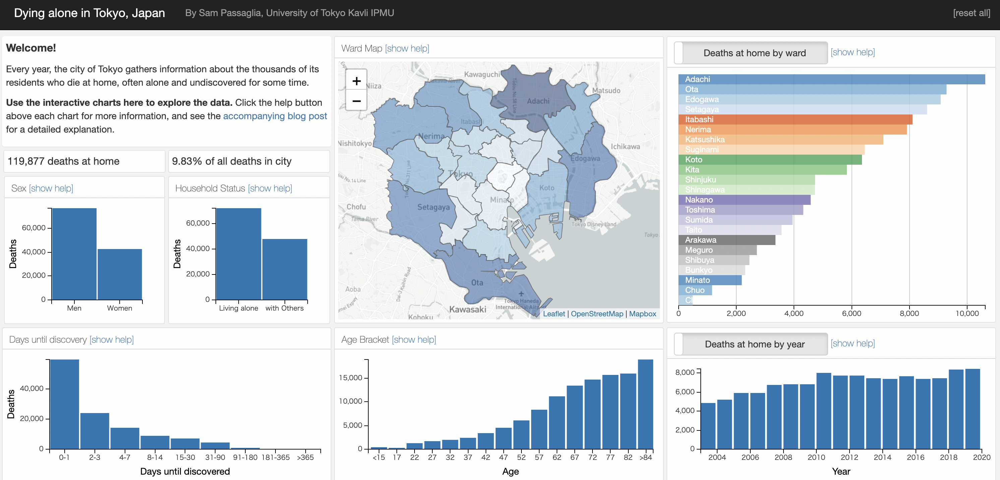

# Tokyo-Dying-Alone

**Tokyo-dying-alone** is a visualization of data surrounding the `Lonely death' problem in Tokyo, Japan. It is available at [passaglia.jp/tokyo-dying-alone](http://passaglia.jp/tokyo-dying-alone).

The data covers 17 years of deaths at home in each ward of Tokyo, including information about gender, age, household status, and time-to-discovery of the deceased.

The dashboard is responsive, being built with [dc.js](https://dc-js.github.io/dc.js/), [crossfilter](https://github.com/crossfilter/crossfilter), and [leaflet](https://leafletjs.com/). The data is processed using [pandas](https://pandas.pydata.org/) and is decompressed in browser using [fflate](https://github.com/101arrowz/fflate). The static site uses [bootstrap](https://getbootstrap.com/).

[](http://passaglia.jp/tokyo-dying-alone)


## Running the dashboard locally

The dashboard can be run locally using the [Flask](https://flask.palletsprojects.com/en/2.0.x/) python framework. To do so, in the root directory run

```
export FLASK_APP=app.py
python3 -m flask run
```

and then open a browser to [127.0.0.1:5000](http://127.0.0.1:5000).

## Deploying as a static site

[Frozen-Flask](https://pythonhosted.org/Frozen-Flask/) is used to convert the Flask app into a static site which is hosted using [Github Pages](https://docs.github.com/ja/pages/getting-started-with-github-pages/about-github-pages).

The build is generated by running

```
python3 freeze.py 
```

and it can be tested locally by entering /build and running

``` 
npx browser-sync start --server
```

The deploy.sh shell script automates deployment as a Github Page.

## To do

-- move my choropleth function to a standalone file / fork the git

-- clean up the code and add comments

-- Reorganize all the libraries

